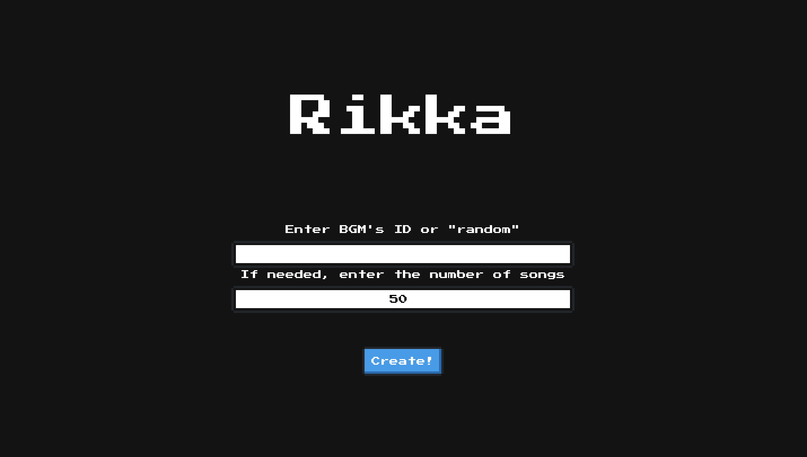

# Rikka



## Overview
Rikka enables users to create two types of playlists that contain only game BGMs in Spotify.

- Playlists containing BGMs that have close features to user-chosen BGM.
- Playlists containing randomly chosen BGMs.

## Getting Started
### 0. Preparation
- Get `Client ID`, `Client Secret` from Spotify for Developers.
    - You also need to set `Redirect URIs` in `EDIT SETTINGS`.
- Execute the command line below.

```
$ export SPOTIFY_CLIENT_ID="{Client ID}"
$ export SPOTIFY_CLIENT_SECRET="{Client Secret}"
$ export SPOTIFY_USERNAME="{Your username in Spotify}"
$ export SPOTIFY_REDIRECT_URL="{Redirect URL}"
```

### 1. Docker image preparation
- Build docker images via

```
$ docker build -t fastapi -f Dockerfiles/FastAPI/Dockerfile .
$ docker build -t nginx -f Dockerfiles/Nginx/Dockerfile .
$ docker build -t mysql -f Dockerfiles/MySQL/Dockerfile .
```

### 2. Start Rikka
- Start application via the command below and access `0.0.0.0:5001`.

```
$ docker-compose up -d
```

## User Guide
### 0. Fill in textboxes
To create playlists, you need to fill in two textboxes (One is not always needed because default number is already set) in advance.

- First textbox: you need to enter ID of each track or "random". ID is included in Spotify's URL of each track.
- Second textbox: the number represents the number of BGMs in playlist. default number is 50. Although you can change the number, you cannot set the number greater than 10000.

### 1. Push the button
After filling in textboxes, you need to `Create!` button.

### 2. Results
- If you enter ID of your chosen song, Rikka redirects to the page of playlist named `{Name of your chosen song}RelatedSongs`.
- If you enter "random", Rikka redirects to the page of playlist named `RandomlyChosenSongs`.